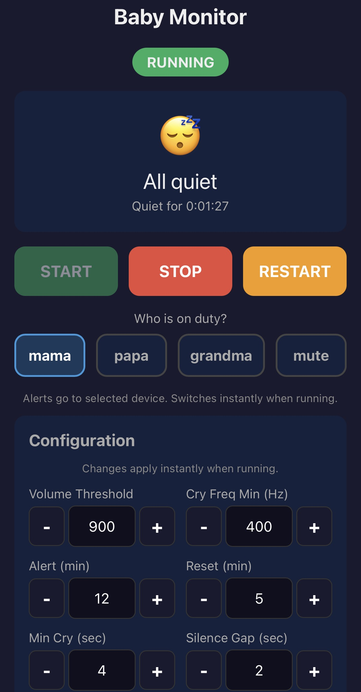

# Baby Cry Detector

A real-time audio-based baby cry detection system built for tired parents who want better sleep. It monitors audio input using frequency analysis, detects crying patterns, and only sends emergency notifications when crying persists beyond a configurable threshold. If the baby cries briefly and settles on their own, no alarm is triggered and parents can keep sleeping.

## What You Need

- **Raspberry Pi** (any model with USB and WiFi)
- **USB microphone** — placed near the baby's crib
- **Pushover app** — for receiving emergency alerts on your phone ($5 one-time per platform after 30-day trial)
- **WiFi network** — so the Pi can send notifications and serve the web interface

That's it. No subscription, no cloud service, no camera. Everything runs locally on your Pi.

## How It Works

1. The USB microphone continuously listens to audio near the crib
2. The detector analyzes each audio chunk for crying frequency patterns
3. Brief sounds like coughs or short fusses are filtered out — no alarm
4. If crying is sustained (default: 4+ seconds), an episode begins and the web UI shows it
5. If crying continues for the alert window (default: 12 minutes), an emergency Pushover notification is sent to the on-duty parent's phone
6. The episode resets after the alarm — if the baby keeps crying, a new episode starts and another alarm will follow
7. Once the baby settles and stays quiet (default: 5 minutes of silence), the episode ends

You control everything from a mobile-friendly web page on your phone — start/stop the monitor, choose who gets alerted, and watch the live status.

## Installation

### 1. Install dependencies

```bash
sudo apt-get install portaudio19-dev python3-pyaudio
sudo pip3 install numpy python-pushover flask --break-system-packages
```

### 2. Set up Pushover

1. Create an account at [pushover.net](https://pushover.net) and install the app ([iOS](https://pushover.net/clients/ios) / [Android](https://pushover.net/clients/android))
2. Note your **User Key** from the Pushover dashboard
3. [Create a new application](https://pushover.net/apps/build) (e.g. "Baby Monitor") and note the **API Token**
4. (Optional) If both parents use Pushover, note each phone's **Device Name** in the app settings — this lets you choose who gets alerted from the web UI
5. Pushover supports notification priorities:
   - **Priority 0** (Normal) - standard notification
   - **Priority 1** (High) - bypasses quiet hours
   - **Priority 2** (Emergency) - requires acknowledgment, retries until ack'd (used by the baby monitor)
6. Create a `config.py` file in the project directory:

```python
PUSHOVER_USER_KEY = "your_user_key"
PUSHOVER_API_TOKEN = "your_api_token"
```

### 3. Set up Healthchecks.io (optional)

Healthchecks.io monitors the Pi's uptime and alerts you if the script stops running (crash, power outage, wifi down, etc.). It also receives /fail pings if the microphone goes silent or Pushover notification delivery fails.

1. Create a free account at [healthchecks.io](https://healthchecks.io)
2. Create a new check with a period slightly longer than your heartbeat interval (e.g., 12 minutes for a 10-minute heartbeat)
3. Copy the ping URL (looks like `https://hc-ping.com/your-uuid`)
4. Add Pushover as an integration
5. Add the following to your `config.py`:

```python
HEALTHCHECK_URL = "https://hc-ping.com/your-uuid"
```

6. (Optional) To auto-pause healthcheck when stopping the monitor (prevents false alerts): go to Account Settings > API Access, get your API key, and add it to `config.py`:

```python
HEALTHCHECK_API_KEY = "your-api-key"
```

### 4. Set up systemd service (recommended)

Systemd makes the web controller start automatically on boot and restart if it crashes.

Create `/etc/systemd/system/babymonitor-web.service`:
```ini
[Unit]
Description=Baby Cry Monitor Web Controller
After=network.target

[Service]
ExecStart=/usr/bin/python3 /home/tinybaby/babymonitor/web_controller.py
WorkingDirectory=/home/tinybaby/babymonitor
User=tinybaby
Restart=on-failure
RestartSec=5

[Install]
WantedBy=multi-user.target
```

```bash
sudo systemctl daemon-reload
sudo systemctl enable babymonitor-web
sudo systemctl start babymonitor-web
```

Useful commands:
```bash
sudo systemctl restart babymonitor-web       # restart after code changes
sudo systemctl status babymonitor-web        # check status
sudo journalctl -u babymonitor-web -f        # follow logs
```

## Usage

### Web Controller (`web_controller.py`)

The recommended way to run the monitor. Open `http://<your-pi-ip>:5000` on your phone.



- START/STOP/RESTART buttons for detector control
- Live status display with emojis (sleeping/crying/alarm/mic silent)
- Crying duration and silence timer in H:MM:SS format
- "Who is on duty?" device selector — switch who gets alerted instantly, or mute notifications entirely
- Configuration form for all detector parameters — changes apply instantly to the running detector (no restart needed) and sync live across all open phones without refreshing
- Event log and real-time log viewer with auto-scroll — configuration changes (alert/reset windows, device/mute switches, etc.) are recorded in the event log
- Auto-pauses healthcheck when stopping (prevents false alerts)
- Log files moved to USB drive on stop for archival

### Cry Detector CLI (`cry_detector.py`)

You can also run the detector directly without the web interface:

```bash
python cry_detector.py --pushover --healthcheck https://hc-ping.com/your-uuid
```

**Options:**
- `-v, --volume` - Volume threshold
- `--cry-freq-min` - Minimum cry frequency in Hz
- `--record` - Enable recording of crying episodes
- `--pushover` - Enable Pushover emergency notifications
- `--pushover-device` - Pushover device name to send to (use `__muted__` to suppress notifications while still monitoring)
- `--alert` - Minutes of crying before alert (default: 12)
- `--reset` - Minutes of silence before episode reset (default: 5)
- `--min-cry` - Seconds of sustained crying before confirming episode (default: 4)
- `--silence-gap` - Seconds of silence within crying that resets detection (default: 2)
- `--stop-at` - Time to auto-stop the script (HH:MM format, e.g. 07:00)
- `--status-port` - Enable HTTP status server on this port
- `--healthcheck` - Healthchecks.io ping URL for uptime monitoring
- `--heartbeat` - Heartbeat interval in minutes (default: 5)

### Receiver (Rainbow HAT) — Optional

For a secondary alert device using a second Raspberry Pi with a Rainbow HAT (LED indicators, buzzer, display), see [RECEIVER.md](RECEIVER.md).

<details>
<summary><strong>Detection Algorithm (technical details)</strong></summary>

1. **Chunk Analysis**: Audio is captured in chunks and analyzed using FFT
2. **Chunk Detection** (`is_crying_now`): Each chunk is evaluated for volume and cry frequency characteristics
3. **Smoothed Detection** (`smoothed_crying`): Requires multiple positive detections in recent chunks to reduce noise
4. **Sustained Detection** (`crying`): Requires smoothed_crying to persist for `min_cry_duration` seconds (filters brief sounds like coughs)
5. **Gap Tolerance**: Brief silences within a crying episode don't reset the sustained detection
6. **Alert**: Triggers after sustained crying exceeds the alert window, then resets the episode
7. **Repeat**: If baby keeps crying after alert, a new episode starts immediately
8. **Reset**: Episode resets after silence exceeds the reset window

</details>
